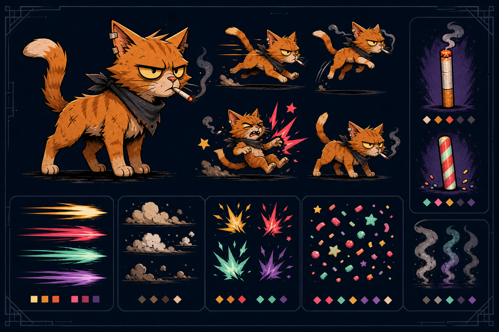

# Visual Direction

## Approved working direction

The first production direction is **grimy neo-retro arcade illustration**: hard inked silhouettes, limited animation-friendly shading, screen-print texture, and bright effects with strict value separation. It should feel funny, hostile, and handmade—not like a generic cute mobile mascot.

This is a concept anchor, not a sprite atlas. Generated poses are not consistent enough to ship directly as animation frames, so production art must translate the design into reusable layered assets or deterministic canvas paths.

## Character rules

- Keep the hero readable as a ginger alley cat at roughly 50 CSS pixels tall.
- Use a nicked-ear, cheek-tuft, heavy-eyelid silhouette to preserve identity without relying on tiny detail.
- Favor a compact body, oversized head, thick paws, and sharp tail gesture.
- Keep skin, glasses, and hat layers independently replaceable.
- Use two-tone shading at most in gameplay sprites; reserve print grain for larger marketing art.
- The encounter prop remains its own layer so Original and Candy modes share the same pose and timing.

## Effects rules

- Speed uses long tapered streaks in coral, mint, gold, or violet.
- Dust uses clustered warm-gray puffs with a few hard flecks.
- Impacts use asymmetric starbursts with one bright core and a dark outline.
- Candy mode replaces smoke wisps with high-contrast confetti, never with collision-obscuring clouds.
- Original smoke stays translucent and desaturated; psychedelic smoke may use violet and mint accents.
- Effects may amplify game feel but must not cover the cat, hazards, encounter meter, or action controls.

## Palette

| Role | Color |
| --- | --- |
| Midnight | `#11131d` |
| Ink | `#08090d` |
| Ginger | `#d9772f` |
| Bone | `#f7f0dc` |
| Coral | `#ff5f57` |
| Mint | `#80e1c1` |
| Gold | `#ffd166` |
| Violet | `#b388ff` |

## Asset provenance

| Asset | Source | Status | SHA-256 |
| --- | --- | --- | --- |
| `docs/art/smoke-break-cat-art-direction-v1.png` | OpenAI built-in image generation, 2026-08-21 | Working concept reference; not shipped in the runtime | `cb8365d06c54fed97f3cf3cc9c087bef79bcb50b72feb63a1c0506840058b395` |

Final generation prompt:

> Create a production-oriented landscape visual-development sheet for a mobile-first 2D arcade runner: one consistent scrappy ginger alley-cat hero with a nicked ear, sharp triangular silhouette, exhausted eyes, and troublemaker energy; large side-view pose plus run, jump, hit, and encounter poses; separate speed streak, dust, impact, candy-confetti, and smoke-wisp swatches; matched original cigarette-sized and striped candy-stick encounter props. Use premium hand-inked neo-retro arcade illustration, chunky readable shapes, limited shading, crisp dark outlines, subtle grimy screen-print texture, and a midnight/coral/mint/gold/violet palette. No humans, UI, logos, readable text, watermarks, glossy 3D, photorealism, anime proportions, muddy values, or generic kawaii treatment.

Generation mode: OpenAI built-in image generation.
